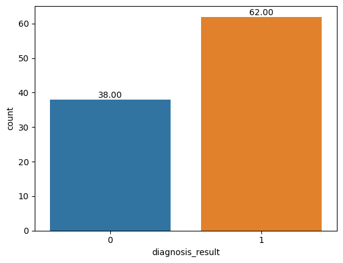
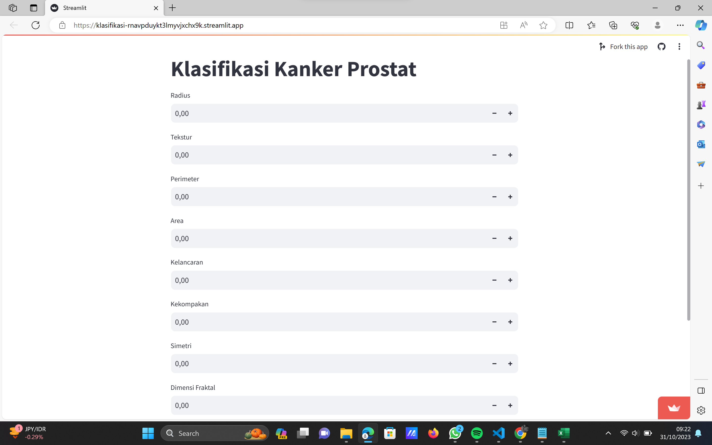

# Laporan Proyek Machine Learning
### Nama : Lia Fitriyanti
### Nim : 211351072
### Kelas : Pagi B

## Domain Proyek

Kanker prostat adalah bentuk kanker yang berkembang di kelenjar prostat. Kanker pada prostat pria, kelenjar kecil seukuran kenari yang menghasilkan cairan mani. Prostat seorang pria menghasilkan cairan mani yang memelihara dan mengangkut sperma. Gejala termasuk kesulitan buang air kecil, tetapi kadang-kadang tidak ada gejala sama sekali. Kanker prostat diklasifikasikan sebagai adenokarsinoma atau kanker kelenjar yang dimulai ketika sel-sel kelenjar prostat mengalami mutasi menjadi sel kanker. Daerah kelenjar prostat dimana adenokarsinoma yang paling banyak ditemukan yaitu pada zona perifer. Awalnya, gumpalan kecil dari sel kanker masih terbatas pada kelenjar prostat yang normal. Kondisi ini dikenal sebagai karsinoma in situ atau prostate intraepithelial neoplasia(PIN). 

  Referensi:
  Klasifikasi Penyakit Kanker Prostat Menggunakan Algoritma Naïve Bayes dan K-Nearest Neighbor

  - https://ojs.unikom.ac.id/index.php/komputika/article/view/9629
  - https://lms--paralel-esaunggul-ac-id.webpkgcache.com/doc/-/s/lms-paralel.esaunggul.ac.id/mod/resource/view.php?id=201905

## Business Understanding

Kanker prostat berkembang ketika sel-sel abnormal di kelenjar prostat tumbuh tidak terkendali, membentuk tumor ganas. Diperkirakan lebih dari 24.200 pria didiagnosis menderita kanker prostat pada tahun 2022. Usia rata-rata saat diagnosis adalah 69 tahun.

### Problem Statements

- Ketidaktahuan masyarakat tentang gejala atau hal-hal yang bisa menyebabkan kanker prostat.

### Goals

- Memberikan informasi tentang gejala kanker prostat melalui aplikasi dengan cara menginputkan hal-hal yang menyebabkan kanker prostat dan mencegah ke stadium lanjut.


    ### Solution statements
    - Membuat platform klasifikasi kanker prostat berbasis web bagi masyarakat untuk memberikan informasi agar mencegah masyarakat ke stadium lanjut.
    - Model yang dihasilkan dari dataset itu menggunakan metode Logistic Regression.

## Data Understanding
Dataset yang saya gunakan berasal dari Kaggle tanda-tanda gejala kanker prostat. Dataset ini berisi 100 baris dan 10 kolom yang terdiri 8 kolom numerik, satu kolom kategori, dan satu kolom ID.

Prostate Cancer
https://www.kaggle.com/datasets/sajidsaifi/prostate-cancer 

### Variabel-variabel pada Heart Failure Prediction Dataset adalah sebagai berikut:
- id : ID pasien (int64)  
- diagnosis_result = hasil diagnosa ada dua type benign cancer / kanker jinak (0), malignant cancer / kanker ganas (1) (object)
- radius = arak antara pusat inti sel dengan tepi sel dari kanker (int64)  
- txture = tingkat perubahan pada tekstur kulit atau jaringan tubuh yang terkena kanker (int64)  
- perimeter = garis keliling inti sel yang diukur sebagai jumlah dari jarak antara titik-titik pada keliling inti sel kanker (int64)  
- area = luas area dari kanker (int64)  
- smoothness = tingkat kehalusan dari kanker (float64)
- compactness = ukuran kepadatan sel kanker (float64)
- symmetry = tingkat kesimetrisan atau ketidaksimetrisan sel kanker (float64)
- fractal_dimension = ukuran kompleksitas atau keberulangan pola pada sel kanker (float64)

Note : diagnosis_result asal nya di visualisasi kan dengan B (benign cancer / kanker jinak) dan M (malignant cancer / kanker ganas) namun di ganti menjadi 0 (benign cancer / kanker jinak) dan 1 (malignant cancer / kanker ganas)


Melihat tingkat perbedaan kanker prostat ganas(0) dan jinak(1) dari grafik tersebut terlihat bahwa pasien yang mengidap kanker prostat dengan type ganas lebih tinggi di banding yang jinak
``` python
import seaborn as sns
splot = sns.countplot(x = 'diagnosis_result', data = df)

for p in splot.patches:
    splot.annotate(format(p.get_height(), '.2f'), (p.get_x() + p.get_width() / 2., p.get_height()), 
                   ha = 'center', va = 'center', xytext = (0, 5), textcoords = 'offset points')
```

## Data Preparation
Pertama, import library yang akan digunakan.
``` python
    import numpy as np
    import pandas as pd
    from sklearn.metrics import accuracy_score
```
Langkah selanjutnya, import file dataset yang akan digunakan. Berhubungan menggunakan vs code, kita tinggal import saja dengan catatan file dataset berada dalam satu folder dengan file jupyter.
``` python
    df = pd.read_csv("Prostate_Cancer.csv")
```
Kemudian melakukan transformasi data pada atribut diagnosis_result agar bisa diolah menggunakan Logisic Regression dan menyimpan hasil transformasi pada file dataset baru.
``` python
    from sklearn.preprocessing import LabelEncoder
    le = LabelEncoder()
    df['diagnosis_result'] = le.fit_transform(df['diagnosis_result'])

    df.to_csv('kanker_prostat.csv')
``` 
## Modeling
Model yang digunakan yaitu Logistic Regression. Pertama, import library yang akan digunakan.
``` python
    from sklearn.model_selection import  train_test_split
    from sklearn.linear_model import LogisticRegression
``` 
Kemudian seleksi fitur yang akan digunakan dan memilih atribut yang akan dijadikan sebagai label.
``` python
    X = df.drop(columns=['diagnosis_result', 'id'], axis=1)
    Y = df['diagnosis_result']
``` 
Selanjutnya, menentukan data yang akan dijadikan menjadi data training dan data testing. Data training berjumlah 80% dari total seluruh data sedangkan data testing berjumlah 20%.
``` python
    x_train, x_test, y_train, y_test = train_test_split(X, Y, test_size=0.2, stratify=Y, random_state=2)
``` 
## Evaluation
Dengan menggunakan algoritma Logistic Regression, didapatkan hasil akurasi dari data training sebesar 0.8375 sedangkan untuk akurasi data testing sebesar 0.9

## Deployment
https://klasifikasi-rnavpduykt3lmyvjxchx9k.streamlit.app/


